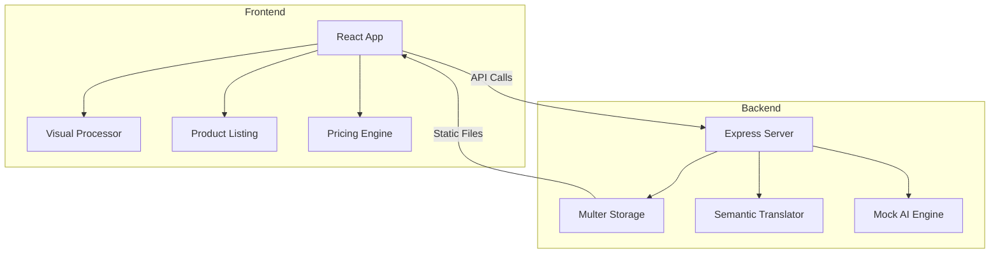

# Project Architecture

## Key Modules
1. **Zero-Input Listing**: Converts Malayalam audio/text to English descriptions.
2. **Studio-in-a-Pocket**: AI-enhanced image processing for artisans.
3. **Dignity-Pricing**: Transparent pricing based on labor hours and material costs.
4. **Artisan Marketplace**: Boutique-style e-commerce interface.
